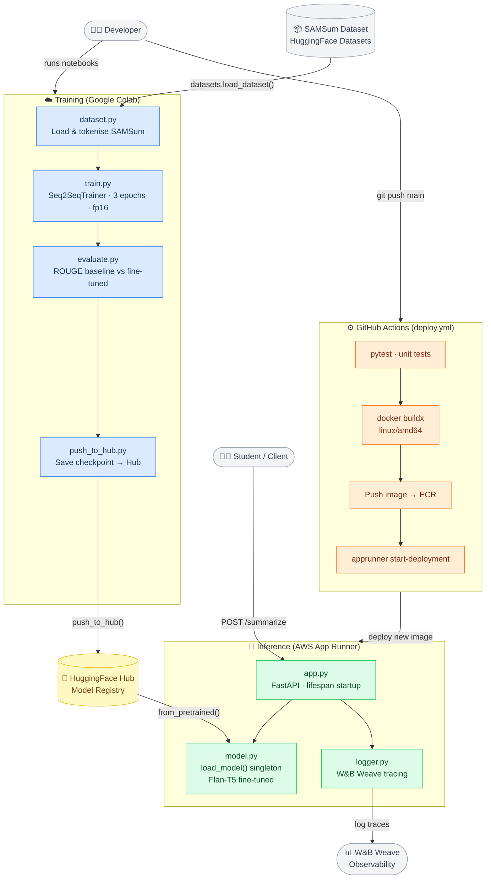

# System Overview — High-Level Architecture

This diagram gives a bird's-eye view of the entire project. The system is split into two independent halves that only communicate through the **HuggingFace Hub**: a **Training** side that runs in Google Colab, and an **Inference** side that runs as a containerised FastAPI service on AWS App Runner. GitHub Actions automates the deployment pipeline, and W&B Weave provides end-to-end observability of every prediction request.

**Key takeaways for students:**
- The two halves are **decoupled** — training never calls the API and the API never calls the trainer.
- HuggingFace Hub acts as the **model registry** / handoff point.
- W&B Weave is **non-blocking**: the API works even if the tracing call fails.
- GitHub Actions only fires when code in `inference/**` changes — training notebooks are deployed manually.
