# Training Pipeline — Data & Model Flow

This diagram traces every step data takes from the raw SAMSum dataset all the way to a fine-tuned checkpoint published on HuggingFace Hub. Each stage maps to a specific source file you can open and read alongside this diagram.

```mermaid
flowchart TD
    %% ── Stage 1: Data Loading ────────────────────────────────
    subgraph LOAD["📦  Stage 1 · Data Loading   (dataset.py)"]
        direction TB
        L1["datasets.load_dataset('samsum')"]
        L2["Train split\n14 732 dialogue–summary pairs"]
        L3["Validation split\n818 pairs"]
        L4["Test split\n819 pairs"]
        L1 --> L2 & L3 & L4
    end

    %% ── Stage 2: Tokenisation ────────────────────────────────
    subgraph TOK["🔤  Stage 2 · Tokenisation   (dataset.py)"]
        direction TB
        K1["Add prefix:\n'summarize: ' + dialogue"]
        K2["AutoTokenizer.from_pretrained()\nflan-t5-base · max_length=512"]
        K3["Tokenise summaries\nmax_length=128"]
        K4["Replace padding token IDs\nwith -100  ← ignored by loss"]
        K1 --> K2 --> K3 --> K4
    end

    %% ── Stage 3: Training ────────────────────────────────────
    subgraph TRLOOP["🏋️  Stage 3 · Training Loop   (train.py)"]
        direction TB
        TR1["Load base model\nT5ForConditionalGeneration"]
        TR2["Seq2SeqTrainingArguments\n· 3 epochs  · fp16=True\n· eval_strategy='epoch'\n· predict_with_generate=True"]
        TR3["Seq2SeqTrainer\n· model  · args\n· train_dataset  · eval_dataset\n· tokenizer  · data_collator"]
        TR4["trainer.train()\nGradient updates per batch"]
        TR5["Checkpoint saved\nevery epoch"]
        TR1 --> TR2 --> TR3 --> TR4 --> TR5
    end

    %% ── Stage 4: Evaluation ──────────────────────────────────
    subgraph EVAL["📊  Stage 4 · Evaluation   (evaluate.py)"]
        direction TB
        E1["Generate summaries\nbase Flan-T5 on test set"]
        E2["Generate summaries\nfine-tuned model on test set"]
        E3["compute_rouge()\nROUGE-1 · ROUGE-2 · ROUGE-L"]
        E4{{"Fine-tuned > Baseline?\n✅ Expected: yes"}}
        E1 --> E3
        E2 --> E3
        E3 --> E4
    end

    %% ── Stage 5: Publish ─────────────────────────────────────
    subgraph PUB["🚀  Stage 5 · Publish   (push_to_hub.py)"]
        direction TB
        P1["Load best checkpoint\nfrom local ./results/"]
        P2["model.push_to_hub()\ntokenizer.push_to_hub()"]
        P3[("🤗 HuggingFace Hub\nyour-username/flan-t5-samsum")]
        P1 --> P2 --> P3
    end

    %% ── Flow between stages ──────────────────────────────────
    LOAD -->|"tokenize_function(batch)"| TOK
    TOK  -->|"tokenized_datasets"| TRLOOP
    TRLOOP -->|"best_checkpoint"| EVAL
    EVAL  -->|"ROUGE scores logged"| PUB

    %% ── Styles ───────────────────────────────────────────────
    classDef loadStyle  fill:#dbeafe,stroke:#3b82f6,color:#1e3a5f
    classDef tokStyle   fill:#ede9fe,stroke:#8b5cf6,color:#2e1065
    classDef trainStyle fill:#dbeafe,stroke:#3b82f6,color:#1e3a5f
    classDef evalStyle  fill:#fef9c3,stroke:#eab308,color:#713f12
    classDef pubStyle   fill:#dcfce7,stroke:#22c55e,color:#14532d

    class L1,L2,L3,L4 loadStyle
    class K1,K2,K3,K4 tokStyle
    class TR1,TR2,TR3,TR4,TR5 trainStyle
    class E1,E2,E3,E4 evalStyle
    class P1,P2,P3 pubStyle
```

**Key concepts for students:**

| Concept | Why it matters |
|---|---|
| `"summarize: "` prefix | Flan-T5 is instruction-tuned — the prefix tells the model what task to perform |
| `-100` label masking | CrossEntropyLoss ignores positions with label `-100`, so padding doesn't affect gradients |
| `predict_with_generate=True` | Forces the trainer to use `model.generate()` during eval, matching inference behaviour |
| `fp16=True` | Half-precision training — halves GPU memory and speeds up training with negligible quality loss |
| ROUGE baseline comparison | Shows the *improvement* from fine-tuning, not just absolute score |
