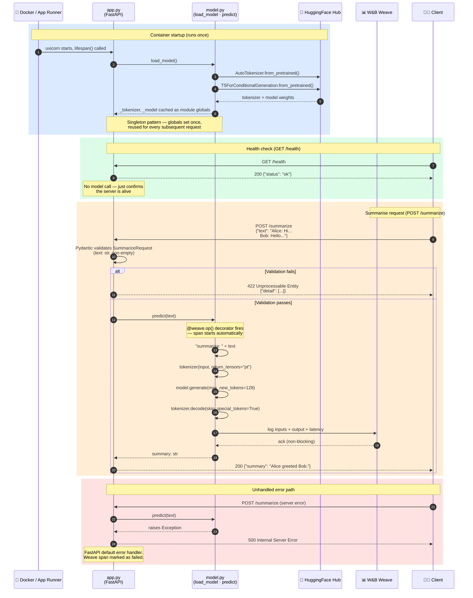

# Inference API — Request Lifecycle

This sequence diagram shows what happens from the moment the container starts up to a completed summarisation response. It highlights two important design decisions: the **lifespan singleton** (the model is loaded exactly once, not per request) and the **W&B Weave tracing** (every prediction is logged automatically via a decorator).

**Key files and their roles:**

| File | Responsibility |
|---|---|
| `app.py` | FastAPI app, `lifespan` context manager, route handlers, Pydantic models |
| `model.py` | `load_model()` singleton loader, `predict()` decorated with `@weave.op()` |
| `logger.py` | `weave.init()` call; imported at startup so Weave is ready before any request |

**Design decisions to discuss with students:**

- **Why a singleton?** Loading a transformer model takes 2–5 seconds and ~500 MB of RAM. Doing it per request would make the API unusably slow.
- **Why `lifespan` instead of a global `import`?** `lifespan` is the FastAPI-recommended pattern and guarantees the model is ready *before* the first request is accepted. It also handles graceful shutdown.
- **Why `@weave.op()`?** The decorator is non-intrusive — `predict()` doesn't know it's being traced. This keeps business logic clean.
