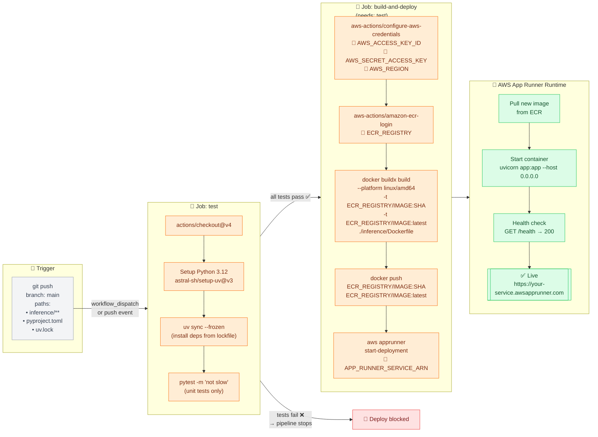

# CI/CD & Deployment Pipeline

This diagram shows the automated path from a developer pushing code to a live updated service on AWS App Runner. The pipeline has two jobs: a fast **test** gate that must pass before anything is deployed, and a **build-and-deploy** job that packages the service into a Docker image and tells App Runner to use it.

**Required GitHub Secrets:**

| Secret name | Used by | Purpose |
|---|---|---|
| `AWS_ACCESS_KEY_ID` | `configure-aws-credentials` | AWS IAM access key |
| `AWS_SECRET_ACCESS_KEY` | `configure-aws-credentials` | AWS IAM secret |
| `AWS_REGION` | `configure-aws-credentials` | e.g. `us-east-1` |
| `ECR_REGISTRY` | `docker buildx`, `docker push` | AWS account ECR URL |
| `APP_RUNNER_SERVICE_ARN` | `aws apprunner start-deployment` | ARN of the App Runner service |

**Key files:**

| File | Role |
|---|---|
| `.github/workflows/deploy.yml` | Defines the full CI/CD pipeline |
| `inference/Dockerfile` | Multi-stage image built with `linux/amd64` for App Runner |

**Design decisions to discuss with students:**

- **Path-filtered trigger** — The workflow only runs when inference code or dependencies change. Pushing a notebook change won't trigger a redeploy.
- **`uv sync --frozen`** — Pins exact dependency versions from the lockfile, making CI reproducible.
- **Two image tags (`$SHA` + `latest`)** — `$SHA` gives traceability (you can roll back to any commit); `latest` makes it easy to pull the current image manually.
- **`linux/amd64` platform flag** — App Runner runs on x86 hardware. Without this flag, building on Apple Silicon (arm64) would produce an image that fails to start.
